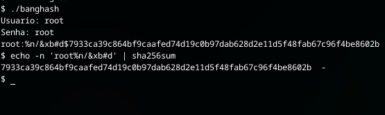

<div align="center">

</div>

# banghash

Exemplo de uso:

### Gerando Hash + Salt da senha
```sh
# Carregamento módulo
source banghash.sh

read -p "Usuario: " user
read -p "Senha: " pass

# Gerando Hash com salt
hash=$(BANG "$pass")

# Enviando para Banco
echo "${user}:${hash}" >> bd.txt
```

Quando chamado a função ***BANG*** ela imprimirá salt(DELIMITADOR)hash gerada.
Você pode alterar o delimitador no próprio módulo.


### Verificar se senha bate com BD.
Pegue a senha de entrada, concatene com o salt do usuário no bd e gere uma hash e faça comparação de hash's
